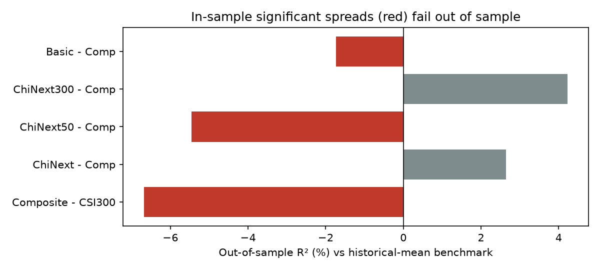
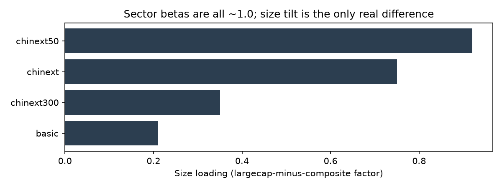

# chinext-predictability

Testing whether return differences between eight ChiNext broad-market
indices are predictable — with strict point-in-time discipline and tests
that fail when something leaks. **The answer is no detectable
predictability: out of sample, the model can't be told apart from a plain
historical mean. What separates these indices is risk, not expected
return.**

## Quickstart

    pip install -r requirements.txt
    python data.py        # pulls daily index data (Sina via akshare), caches to data/
    python main.py        # runs the full study, writes tables and figures to results/
    pytest                # runs the leakage tests

Raw data isn't committed (the original study used licensed terminal
exports that can't be redistributed), which is why `data.py` exists. The
full run takes a few minutes on a laptop.

This is a public rebuild of a study I first designed during an
internship. Same design, same 120-month window (2014-12 to 2024-11), free
data sources, and every number below comes from this repo.
DESIGN_NOTES.md lists exactly what differs and why.

## Research design

The eight indices correlate at 0.95+ monthly, so regressing each one
separately would estimate the same thing eight times. I split the problem
into two layers: ChiNext-vs-CSI300 (is the sector worth holding?) and
each-index-vs-Composite (which slice?). By construction the two layers add
back up to each index's excess return over CSI 300.

Three monthly factors, all computable at month-end t: 12-1 momentum
(relative to the spread's benchmark), realized volatility from daily
returns, and a dollar-volume percentile as an activity proxy. The design
had a fourth factor — an E/P plus B/P valuation composite — but free
sources don't provide PE history for enough of these indices, so the
public version runs with three.

Estimation is OLS with Newey-West errors. Out-of-sample: train on the
first 80% of each sample chronologically, freeze the coefficients, predict
the last 20%, and benchmark against predicting the training-period mean.

## Data, and the backfill problem

Several of these indices were launched years after their base date, and
vendor data fills the gap with backfilled simulation. On licensed data
that has to be handled in tiers, with real-period rechecks for anything
that keeps substantial backfill.

The public data makes this simpler in an honest way: Sina serves each
index from its launch date, so there is no backfilled history here at
all. The cost is sample: LargeCap has only 33 usable months in the study
window (below the 36-month floor fixed before any results, so it's
descriptive only), and ChiNext 200 / Small Cap have essentially none.
Five spreads remain for the regressions.

## Validity checks

Two test files guard the pipeline, six tests in all.
`tests/test_no_lookahead.py` truncates all raw data after a cutoff month,
reruns the whole feature pipeline, and asserts the factor values at the
cutoff are identical to 10 decimal places. `tests/test_target_and_split.py`
covers what that test can't see: it rebuilds the target from raw prices
and checks it is next month's spread (not this month's), and it scrambles
the test-period targets to check that no out-of-sample prediction moves.
I checked the tests themselves by planting both leaks on purpose — setting
the target to the current month, and fitting on the full sample — and
each one turns `pytest` red.

On the regression side: the spreads are stationary, factor VIFs stay
under 1.5, and Durbin-Watson sits at 1.9-2.1; inference uses Newey-West
errors throughout. The tiering rules were fixed before any results were
seen.

## Results

In-sample, four of the 15 coefficients clear the 5% bar: momentum on the
sector spread (t = -2.22, a reversal), volatility on the sector spread
(t = +2.20), momentum on the ChiNext50 spread (t = +2.65, a continuation),
and, only just, dollar volume on the Basic spread (t = -1.98, p = 0.047).
R² sits between 2% and 7%, normal territory for monthly return
prediction.

Dropping the 2015 crash (2015-01 to 2016-02) takes most of that apart.
Sector momentum goes from t = -2.22 to -0.25 — it was the crash. Sector
volatility weakens to 1.50 and Basic's dollar volume to -1.62, both below
the bar. ChiNext50's sample starts in 2017, so the crash was never in it;
its signal survives this check and has to be judged out of sample
instead.

Out of sample, nothing holds up:

| Spread              | In-sample significant? | OOS R²  | 95% interval     | Hit rate (model / mean) |
|---------------------|------------------------|---------|------------------|-------------------------|
| Composite − CSI300  | yes (mom, vol)         | -6.7%   | -80% to +24%     | 42% / 54%               |
| ChiNext50 − Comp    | yes (mom)              | -5.5%   | -82% to +30%     | 58% / 58%               |
| Basic − Comp        | yes (dvol, p = 0.047)  | -1.7%   | -40% to +10%     | 63% / 71%               |
| ChiNext − Comp      | no                     | +2.6%   | -11% to +11%     | 54% / 50%               |
| ChiNext300 − Comp   | no                     | +4.2%   | -7% to +10%      | 59% / 64%               |

Put the two side by side and they don't match: every spread that looked
significant in-sample comes out negative, and the model's hit rate mostly
sits below just predicting the training-period mean. This is overfitting —
the model learned noise, not signal. The intervals are the other half of
the story: with 19 to 24 test months each one spans zero, so the two
small positives can't be told apart from noise either. "No detectable
predictability" is the honest summary, consistent with Welch & Goyal
(2008), whose paper I should have read before building the model rather
than after.

What actually distinguishes these indices is risk. Over 2015-2024 they all
run at 32-35% annualized volatility (CSI 300: 21%) with maximum drawdowns
of -63% to -71%, and a two-factor decomposition (sector + size) gets R²
above 0.98 for every index I can estimate. Sector betas are all ~1.0; the
only real dimension is size tilt: +0.92 (ChiNext 50) down to +0.21
(Basic), with the two young small-cap indices too short to estimate on
public data. Two details I didn't expect: the index selected by trading
volume (ChiNext 50) carries the most extreme large-cap tilt, and the index
built to cover 85% of market cap behaves almost exactly like the whole
market (s = 0.21). Construction documents tell you the sign of a tilt, not
its size.

## Limitations

Price indices only, so dividends are ignored (understates CSI 300 by
1-2%/yr — a level effect, not a timing one). The valuation factor is
absent, and the turnover factor is proxied by dollar volume. Only the
one-month horizon is tested. The three youngest indices contribute little
or nothing — that's the honest price of refusing backfilled history. And
on multiple testing: four of 15 coefficients clearing 5% is more than
chance alone would hand you (about 0.75 expected), so the in-sample
signals aren't pure noise from running many tests — but the crash check
and the out-of-sample results say they don't hold up as rules either.

## Repo structure

`data.py` pulls and caches raw index data · `features.py` builds the
factors with expanding windows · `regressions.py` runs OLS + Newey-West
and diagnostics · `robustness.py` reruns them without the 2015 crash ·
`oos.py` does the 80/20 evaluation with bootstrap intervals · `risk.py`
computes risk metrics and the two-factor loadings · `evaluate.py` makes
the figures · `main.py` runs everything in order · `tests/` holds the
leakage tests.

## References

Welch, I. and Goyal, A. (2008). A Comprehensive Look at the Empirical
Performance of Equity Premium Prediction. *Review of Financial Studies*.
